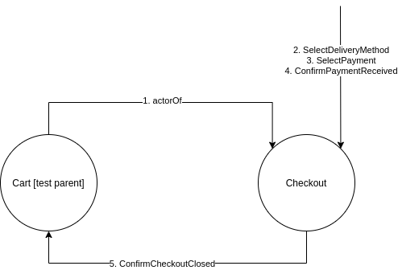

## Programowanie reaktywne w jezyku Scala 

### Uzycie akka testkit w ScalaTest 
- Jako narzędzia do testowania używamy [ScalaTest](http://www.scalatest.org). ScalaTest oferuje różne <a href="http://www.scalatest.org/user_guide/selecting_a_style">style testowania</a> 
czyli sposoby deklarowania testów. W przykładzie wykorzystano naturalny styl 
<a href=http://doc.scalatest.org/3.0.0/#org.scalatest.WordSpec>WordSpec</a> (trait <i>WordSpecLike</i>)
- Trait <a href="http://doc.scalatest.org/3.0.0/org/scalatest/BeforeAndAfterAll.html"><i>BeforeAndAfterAll</i></a> zapewnia 
funkcje do wykonania przed i po zestawie testów. W przykładzie pokazano, jak wykorzystać funkcje <i>afterAll</i> do zamknięcia 
systemu aktorów po zakonczeniu testów.

    
### Testowanie aktorów

Do testowania aktorów wykorzystujemy moduł <a href=http://doc.akka.io/docs/akka/current/scala/testing.html>akka-testkit</a>. W przykładzie rozszerzana jest klasa TestKit inicjalizowana systemem aktorów do testowania. 
1. **Testowanie aktora w jednym wątku**. Testowanie stanu wewnętrznego aktora może odbywać się przy pomocy *TestActorRef*,
         wtedy aktor jest wywoływany w tym samym wątku, co cały test, ale dzięki temu możemy bezpiecznie przetestować zmiany jego wewnętrznego stanu.
         <a href="https://github.com/agh-reactive/reactive-lab3/blob/master/src/test/scala/myActorTest/CounterSpec.scala">Przykład</a> testowania wewnętrznego stanu licznika.

2. **Wielowątkowe testowanie poprzez wiadomości**.
   * Akka TestKit tworzy wewnętrznego testującego aktora (o nawie testActor), który służy do komunikacji z testowanymi aktorami </li>
   * Odpowiedzi od testowanych aktorów są kolejkowane przez testującego aktora i mogą być badane przy użyciu <a href="https://doc.akka.io/docs/akka/current/scala/testing.html#built-in-assertions">asercji</a> takich jak <i>expectMsg</i>.
   * Jeśli aktor wysyła wiadomości do więcej niż jednego aktora możemy przetestować to używając mechanizmu <a href="https://doc.akka.io/docs/akka/current/scala/testing.html#using-multiple-probe-actors">TestProbe</a>.
   * Uzycie traitu <i>ImplicitSender</i> powoduje, że aktor testujący jest domyślnie używany jako ten, który wysyła wiadomości do testowanych aktorów.
   * <a href="https://github.com/agh-reactive/reactive-lab3/blob/master/src/test/scala/myActorTest/ToggleSpec.scala"> Przykład</a> testuje aktora Toggle z poprzedniego przykladu z laboratorium 2
   * W zestawie zawarte są trzy testy w stylu <i>WordSpec</i></li>

<h3>Jak uruchomić testy?</h3>
<ul>
    <li> Pobrać projekt potrzebny do wykonania ćwiczenia. </li>
<pre>
  git clone https://github.com/agh-reactive/reactive-lab3
</pre>
    <li> Przykłady testów znajdują sie w katalogu src/test/scala/myActorTest/ </li>
    <li> uruchomienie programów znajdujacego sie w src/main/scala: <pre>sbt run</pre> </li>
    <li> uruchamienie testowanie za pomocą ScalaTest: <pre>sbt test</pre>   </li>
    <li>
        Dla korzystających z IDE:
        <a href="https://docs.scala-lang.org/getting-started-intellij-track/testing-scala-in-intellij-with-scalatest.html">
            Opis uruchamiania testów w IntelliJ IDEA</a>
    </li>
</ul>

### Zadania
    Szablon do zadań z Laboratorium 3:
    <a href="https://github.com/agh-reactive/reactive-scala-labs-templates/tree/lab-3">https://github.com/agh-reactive/reactive-scala-labs-templates/tree/lab-3</a> <b>(proszę pamiętać o scaleniu rozwiązań z laboratorium numer 2)</b>
1. (20 pkt)
   * Proszę dodać do systemu aukcyjnego aktorów <b>OrderManager</b> i <b>Payment</b>, a następnie utworzyć system aktorów działający zgodnie z diagramem:
            

            
   * Napisać testy dla aktora CartActor. Testy powinny zawierać:
     * testowanie synchroniczne - test zmiany zawartości koszyka przy użyciu
<a href="https://doc.akka.io/docs/akka/current/scala/testing.html#synchronous-testing-testactorref"><i>TestActorRef</i></a>
     * testowanie asynchroniczne za pomocą  aktora testActor i asercji typu  <i>expectMsg</i>.</li>
    * alternatywnie:
      * Testy za pomocą <a href="https://doc.akka.io/docs/akka/current/typed/testing.html"><i>Testing Akka Typed</i></a></li>
2. (10 pkt) Wykorzystując Akka TestKit proszę napisac testy dla aktora <b>Checkout</b></li> zawierające reakcję na  komunikaty wg diagramu poniżej.
        Zestaw powinien zawierać test relacji <a href="https://doc.akka.io/docs/akka/current/scala/testing.html#testing-parent-child-relationships">rodzic-dziecko</a>
        w szczególności sprawdzenie, czy <b>CartActor</b> dostaje komunikat <i>CheckoutClosed</i> od testowanego aktora <b>CheckOut</b> (patrz diagram)
        

        
    

3. (10 pkt) Proszę w aktorze TypedOrderManager (typowany) zastosować wzorzec <A HREF="https://doc.akka.io/docs/akka/current/typed/interaction-patterns.html#adapted-response">Adapted Response</A>. 
        Uwaga: rozwiązanie tego zadania powinno być zrealizowane w osobnej gałęzi (szczegóły w instrukcji do przesyłania zadania).   

---

<i>Bartosz Baliś, balis at agh edu pl</i>

<i>Maciej Malawski, malawski at agh edu pl</i>

<i>Katarzyna Rycerz, kzajac at agh edu pl</i>

<i>Krzysztof Borowski, kborowski at agh edu pl</i>
